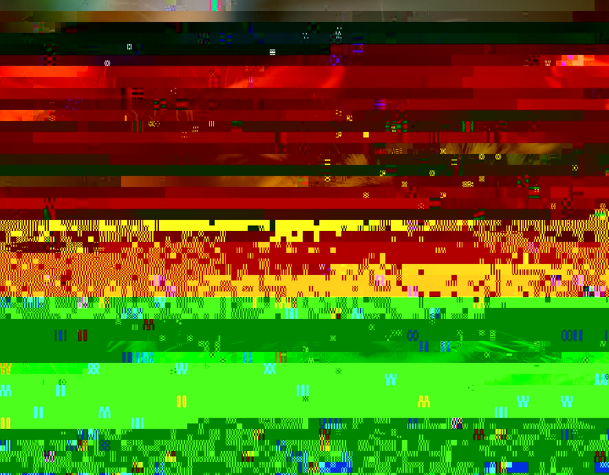

# Сервис управления рассылками на Django
## Задача:
- Реализовать интерфейс заполнения рассылок: CRUD-механизм для управления рассылками.
- Реализовать скрипт рассылки, который работает как из командной строки, так и по расписанию.
- Добавить настройки конфигурации для периодического запуска задачи.
- Расширить модель пользователя для регистрации по почте, а также верификации.
- Добавить интерфейс для входа, регистрации и подтверждения почтового ящика.
- Реализовать ограничение доступа к рассылкам для разных пользователей.
- Создать блог для продвижения сервиса.
- Реализовать главную страницу.

## Реализованная логика работы рассылки
- При создании рассылки пользователь вводит тему и текст письма, выбирает получателей, указывает дату начала и дату окончания рассылки, её периодичность:
    - можно задать рассылку с несколькими разными настройками времени (например, если мы хотим отправлять её в определённые периоды по нескольку дней несколько раз в год);
    - на уровне контроллера запрещено создание рассылки в прошлом;
    - на уровне контроллера валидируется, что дата окончания рассылки должна быть больше даты начала.
- По умолчанию каждой новой рассылке при сохранении устанавливается статус "создана".
- При наступлении даты рассылки её статус автоматически будет изменён на "запущена", из справочника будут выбраны все получатели, которые указаны в настройках рассылки, 
и запущена отправка на все email адреса получателей.
- Если создается рассылка со временем старта в будущем, то отправка стартует автоматически по наступлению этого времени без дополнительных 
действий со стороны пользователя системы.
- После отправки рассылки в базе устанавливается время её следующей отправки в зависимости от выбранной периодичности (ежедневно, еженедельно или ежемесячно).
- После окончания времени рассылки её статус автоматически будет переведён в состояние завершённой.
- По ходу отправки сообщений собирается статистика (id сообщения, дата и время рассылки, 
статус - успешно / не успешно, сообщение об ошибке, если оно было)
по каждому сообщению для последующего формирования отчетов.
- Автоматическая рассылка реализована с помощью библиотеки django-crontab. По умолчанию система проверяет наличие новых рассылок и отправляет их с периодичностью 5 минут (настройку можно изменить в config/settings.py -> CRONJOBS).
- Добавление автоматической рассылки
```python
python manage.py crontab add
```
- Рассылка может быть запущена в любое время из командной строки с помощью кастомной команды.
```python
python manage.py getmail
```

## Пользователи:
### Администратор системы (суперпользователь)
- Команда для создания суперпользователя
```python
python manage.py ccsu
```
### Интерфейс пользователя системы
- Расширена модель пользователя для регистрации по почте, а также верификации электронного адреса. Добавлен интерфейс для входа, регистрации и подтверждения почтового ящика, редактирования профиля.
- Пользователь может создавать рассылки, добавлять подписчиков, управлять своими рассылками и списком подписчиков.
- Каждый пользователь системы имеет доступ только к своему списку рассылок и подписчиков.
### Функционал менеджеров рассылки
- Может просматривать любые рассылки.
- Может просматривать список пользователей сервиса.
- Может просматривать список подписчиков всех пользователей.
- Может блокировать пользователей сервиса (кроме суперадминов). 
- Может отключать рассылки. 
- Не может редактировать рассылки других пользователей.
- Не может редактировать подписчиков других пользователей.
- Не может управлять списком рассылок.


## Блог
В сущность блога добавлены следующие поля:
- заголовок,
- содержимое статьи,
- изображение,
- количество просмотров,
- дата публикации,
- автор.

Для ведения блога необходимо настроить административную панель для контент-менеджера.


## Главная страница
На главной странице отображается информация:
- количество рассылок всего,
- количество активных рассылок,
- количество уникальных клиентов для рассылок,
- 3 случайные статьи из блога.

Для статей блога и отображения количества активных рассылок включено кэширование (Redis).

Необходимые для работы библиотеки указаны в requirements.txt. Примеры переменных окружения указаны в файле .env_sample

Работа выполнена на основе [ТЗ](https://my.sky.pro/student-cabinet/stream-module/10981/course-final-work/materials).



